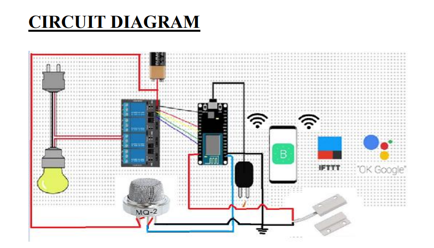

# IOT_HomeAutomation

To control home appliances through mobile app and google assistant and to receive
mobile notification in case of burglary and smoke and LPG gas detection.

## APPARATUS REQUIRED

- NodeMCU microcontroller
- 2 - Relay 5V, 10A
- Light bulb with socket 6W
- Magnetic reed switch
- Blynk application
- Arduino IDE
- MQ2 gas sensor
- IFTTT
- 7805 voltage regulator
- Smart phone
- WI-FI
- Fan -DC motor 5V
- Connecting wires
- 9V battery
- Breadboard
- Jumper wires

