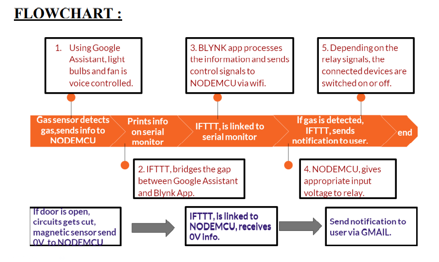

# IOT_HomeAutomation


To control home appliances through mobile app and google assistant and to receive
mobile notification in case of burglary and smoke and LPG gas detection.

## APPARATUS REQUIRED

- NodeMCU microcontroller
- 2 - Relay 5V, 10A
- Light bulb with socket 6W
- Magnetic reed switch
- Blynk application
- Arduino IDE
- MQ2 gas sensor
- IFTTT
- 7805 voltage regulator
- Smart phone
- WI-FI
- Fan -DC motor 5V
- Connecting wires
- 9V battery
- Breadboard
- Jumper wires


# Component specifications

## 1. NodeMCU

```
● Developer : ESP8266 Open Source Community
● Type : Single-board microcontroller
● CPU : ESP
```
```
● Memory : 128 kBytes
● Storage : 4 MBytes
```
```
● Power By : USB
● Power Voltage : 3v ,5v (used with 3.3v Regulator which inbuilt on Board
using Pin VIN)
```
```
● IDE Used : Arduino IDE
```
## 2 .MQ2 gas sensor

```
● Operating Voltage is +5V
```
```
● Can be used to Measure or detect LPG, Alcohol, Propane, Hydrogen,
CO,smoke and even methane.
```
```
● Analog output voltage: 0V to 5V
● Digital Output Voltage: 0V or 5V (TTL Logic)
● Preheat duration 20 seconds
```
```
● Can be used as a Digital or analog sensor
● The Sensitivity of Digital pin can be varied using the potentiometer
```
## 3. Magnetic reed switch

- Contact Capacity: 0.5A(Max Switch current)
- Rated Power: 10W
- Actuation Distance: 15-25mm


## 4. Relay

- A relay switches one or more poles, each of whose contacts can be thrown
    by energizing the coil
- Relay Output: DC 30V/10A or 250V/10A
- Relay high quality single relay single pole double throw
- Input voltage 5V

## 5. 7805 regulator

```
● Input voltage range 7V- 35V
● Current rating Ic = 1A
```
```
● Output voltage range VMax=5.2V ,VMin=4.8V
```
## 6. IFTTT

```
● IFTTT, is a free web based service to create chains of simple conditional
statements, called applets.An applet is triggered by changes that occur
within other web services.
```
## 7. BLYNK app

```
● Blynk is a Platform with iOS and Android apps to control Arduino,
Raspberry Pi and the likes over the Internet.
```
```
● It's a digital dashboard where you can build a graphic interface for your
project by simply dragging and dropping widgets
```

## THEORY:

```
Nodemcu microcontroller
```
```
● NodeMCU is an open source IoT platform. Which includes firmware which
runs on the ESP8266 Wi-Fi Module from Espressif Systems,and hardware
which is based on the ESP-12 module.
```
Key points of Nodemcu

- Arduino-like hardware IO.
- Nodejs style network API
- Low cost wifi

### Features

```
● Programmable WiFi module.
● Arduino-like (software defined) hardware IO.
● Can be programmed with the simple and powerful Lua programming
language or Arduino IDE.
● USB-TTL included, plug & play.
```

```
● 10 GPIOs D0-D10, PWM functionality, IIC and SPI communication, 1-Wire
and ADC A0 etc. all in one board.
● Wifi networking (can be used as access point and/or station, host a web
server), connect to internet to fetch or upload data.
● Event-driven API for network applications.
● PCB antenna.
```
Magnetic reed switch

- In a reed switch when a magnet is positioned right next to it, it switches on,
    allowing a current to flow through it.
- Take the magnet away and the contacts—made from fairly stiff and springy
    metal—push apart again and return back to their original positions, breaking
    the circuit open
- As you bring a magnet up to the reed switch, the entire switch effectively
    becomes a part of a "magnetic circuit" that includes the magnet The two
    contacts of the reed switch become opposite magnetic poles, which is why
    they attract and snap together


- Have a reed switch on the door frame and a magnet on the door. Opening the
    door would separate the magnet and the reed switch, causing the switch's
    contacts to spring apart and trigger the alarm. You can get reed switches
    built inside little pieces of plastic so you can't even see they're there—perfect
    for all kinds of security applications.

MQ2 gas sensor

- It is a Metal Oxide Semiconductor (MOS) type Gas Sensor also known as
    Chemiresistors as the detection is based upon change of resistance of the
    sensing material when the Gas comes in contact with the material. Using a
    simple voltage divider network, concentrations of gas can be detected
- The greater the gas concentration,the greaterthe output voltage
- The lowerthe gas concentration,the lowerthe output voltage
- Using an MQ sensor it detects a gas is very easy. You can either use the
    digital pin or the analog pin to accomplish this. Simply power the module
    with 5V and you should notice the power LED on the module to glow and
    when no gas it detected the output LED will remain turned off meaning the
    digital output pin will be 0V.





